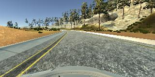
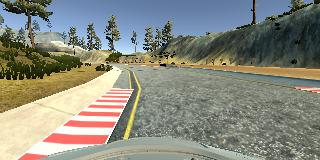
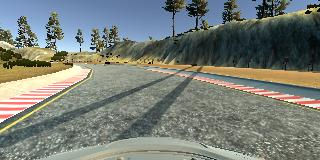
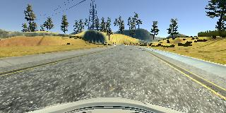
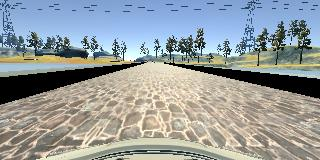

# **Behavioral Cloning** 

## Writeup

**Behavioral Cloning Project**

The goals / steps of this project are the following:

* Use the simulator to collect data of good driving behavior
* Build, a convolution neural network in Keras that predicts steering angles from images
* Train and validate the model with a training and validation set
* Test that the model successfully drives around track one without leaving the road
* Summarize the results with a written report

### Submission

 <span style="color:red">
\# EDIT \#  
After the first submission, I made some changes due to the review, these should be higlighted in RED (if html works)
\#
</span>

#### 1. Files

My project includes the following files:

* `model.py`  containing the script to create and train the model
* `drive.py` for driving the car in autonomous mode
* `model.h5` containing a trained convolution neural network 
* `writeup_report.md` summarizing the results (this file)
* `video.mp4` video showing the car staying on the road

#### 2. Start simulator and drive
Using the Udacity provided simulator, the car can be driven autonomously around the track by executing 
```sh
python drive.py model.h5
```

#### 3. Submitted Code

The `model.py` file contains the code for training and saving the convolution neural network. The file shows the pipeline I used for training and validating the model. The `main()` method contains the relevant steps to load the data, preprocess it, train the model and save the latter.

The `drive.py` file has only been altered slightly for postprocessing.

### Model Architecture and Training

#### 0. Preprocessing
~~
To reduce training data the recorded images are converted to RGB and scalled down to half width and height while loading `model.py :40-42:` and before inference `drive.py :65:`.
~~
 <span style="color:red">\# \#
To get a better result video and to remove the preprocessing before the inference, the resizing task is now handled by an Average Pooling Layer in the NN `model.py :85:`
The image is still converted to RGB though `model.py :50:`.
\#
</span>

There was also an idea to augment `model.py :54: enhance()` the training data by mirroring images and angles. There seemed to be some errors initially in the code and I ended up with a functioning solution without the augmentation. 

Another not followed idea was to use the left and right images with a fixed angle offset.

#### 1. NN Structure

The NN-Model is based on the NVIDIA Network presented in the lecture videos.

To reduce complexity, the network has initially been stripped to every second layer. The idea was to start with a simpler approach and reinsert elements in case needed. It turned out to work fine without reactiviating the stripped layers.

The resulting network `model.py :80: get_nn()` has the following structure:

| Layer | Description |
| ------- | ---------|
| Input (160x320x3) | Normalized [-0.5 .. 0.5] |
| <span style="color:red">\# AveragePooling (2,2) </span> | <span style="color:red"> strides  2x2  \# </span> |
| Crop (top 36px, bottom 13px) | 
| Convulution (24x5x5) |	strides 2x2 |
| ReLu Activation|
| Convulution (48x5x5) |	strides 2x2 |
| ReLu Activation|
| Convulution (64x3x3) |
| ReLu Activation|
| DropOut | Keep 60% |
| Flatten |
| Fully connected (100)
| DropOut | Keep 60% |
| Fully connected (10)
| Fully connected (1)

Dropouts have been added to create a structure less prone to overfitting to get a resutling network that is more robust.
Training and validation data have been randomized and split  <span style="color:red"> \# EDIT \#. Data is loaded by a generator function to keep memory usage small.  model.py :80: train_nn_with_generator() \#</span>


#### 3. Training / Tuning

Initially the model was setup to use about 5 epochs, this was later reduced to only 2. The learning rate was set to 0.001.

The trainingdata consited of the given example data plus several rounds of self recorded driving in both directions.
Trainingdata has only been collected for track one due to the delay in the term / projects.

##### Input Images
<span style="color:red">\# \# To get an idea of the input data to the network, a few images are shown here exemplarily:
<span>

|image|  |
| -- |: - :|
|| yellow lane markers |
|| red curbes |
|| shadows |
|| differnet horizons |
|| drifferent road (bridge) |


#### 4. Postprocessing

The trained model was tested in the provided simulation. As the model is a bit prone to general understeering, instead of further tuning the Network, the output is postprocessed. A Simple multiplication of the output angle by 2 solves the issue and gives a pretty smooth trajectory `drive.py :72:`.

### Result

 [`video.mp4`](video.mp4) shows the car staying on the track for more than a full round on track one.
 
~~ The video seems to be recorded after the processing of the `drive.py` script so the resolution is just the scaled down one of 160x80 px wich, especially after encoding it for mp4 looks very blury unfortunately when viewed in fullscreen. ~~
<span style="color:red">
\# EDIT \#  
After resubmitting, and changing to a pooling layer, the video is now better as well
\#
</span>